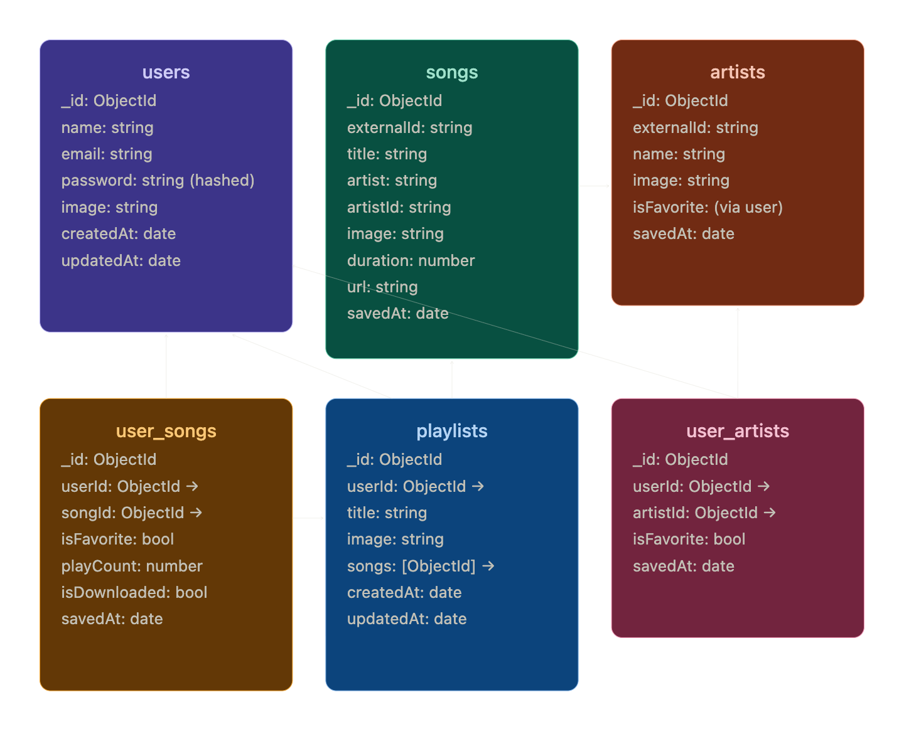

# Bewa Music - Project Architecture

This document describes the architectural design and data flow of the Bewa Music application.

## 1. Project Overview

Bewa Music is a cross-platform mobile application built with Flutter, designed for high-quality music streaming and management. It uses a **No-SQL MongoDB** backend for scalable data storage and efficient cataloging of millions of songs and artists.

## 2. Tech Stack

- **Frontend**: [Flutter](https://flutter.dev/) (Dart)
- **Backend/Database**: [MongoDB](https://www.mongodb.com/) via `mongo_dart`
- **State Management**: [Provider](https://pub.dev/packages/provider)
- **Internationalization**: [Flutter Localization (l10n)](https://docs.flutter.dev/ui/accessibility-and-localization/internationalization)
- **Environment Management**: [flutter_dotenv](https://pub.dev/packages/flutter_dotenv)

---

## 3. Database Architecture (No-SQL MongoDB)

The database design separates the **global catalog** from **user-specific data** to optimize performance and prevent duplication.

### 3.1 Global Catalog

- **`songs`**: Stores metadata for every song ever discovered or saved. Linked to artists via `artistId`.
- **`artists`**: Stores artist profiles (names, images).
- **Bridge**: `externalId` is used to match data coming from external sources (crawlers/scrapers) with the internal database records.

### 3.2 User Data

- **`users`**: Basic profile, credentials, and timestamps.
- **`playlists`**: Custom collections created by users. Contains an array of song `ObjectIds`.

### 3.3 Junction Collections (Relationships)

- **`user_songs`**: Tracks individual user relationships with songs:
  - **Favorites**: `isFavorite: true`
  - **History/Analytics**: `playCount`
  - **Offline storage**: `isDownloaded: true`
- **`user_artists`**: Tracks favorite artists per user.



---

## 4. Application Layers & Data Flow

### 4.1 Data Layer (`lib/models`, `lib/services`)

- **`info_models.dart`**: Defines the data structures used throughout the app. Includes logic for serializing/deserializing MongoDB `ObjectId` and `DateTime` objects.
- **`DBConnector`**: The centralized service for all database interactions (CRUD).
- **`WebScraper`**: Responsibile for discovering new content from external sources.

### 4.2 Business Logic (`lib/services`)

- **`SongPlayer`**: Manages audio playback and state.
- **`AudioFileCompressor`**: Optimizes audio files for storage and streaming efficiency.
- **`AdBlocker`**: Enhances user experience by filtering undesirable content.

### 4.3 Presentation Layer (`lib/screens`, `lib/widgets`)

The UI is organized by functional area:

- **`auth/`**: Sign-in and sign-up flows.
- **`home_screen.dart`**: Personalized content and quick access.
- **`explore_screen.dart`**: Discovery of new music via the `WebScraper` and catalog.
- **`song_playing_screen.dart`**: High-fidelity playback interface.

---

## 5. Key Design Principles

1.  **Normalization vs. Embedding**: We use ObjectIDs and junction collections for high-frequency user data (`user_songs`) to keep the `users` document small and fast.
2.  **External Sync**: The `externalId` system ensures that when multiple users save the same song, only one entry is created in the global `songs` catalog.
3.  **Local-First Preparation**: `isDownloaded` flags in `user_songs` prepare the app for future offline playback capabilities.

---

## 6. Directory Structure

```text
lib/
├── db-scripts/     # Database initialization and indexing
├── l10n/           # Multi-language support (EN, ES)
├── models/         # Data structures and JSON mapping
├── providers/      # Application-wide state management
├── screens/        # Main UI views
├── services/       # Core business logic and DB access
├── themes/         # Visual styling (palette, typography)
└── widgets/        # Reusable UI components
```
